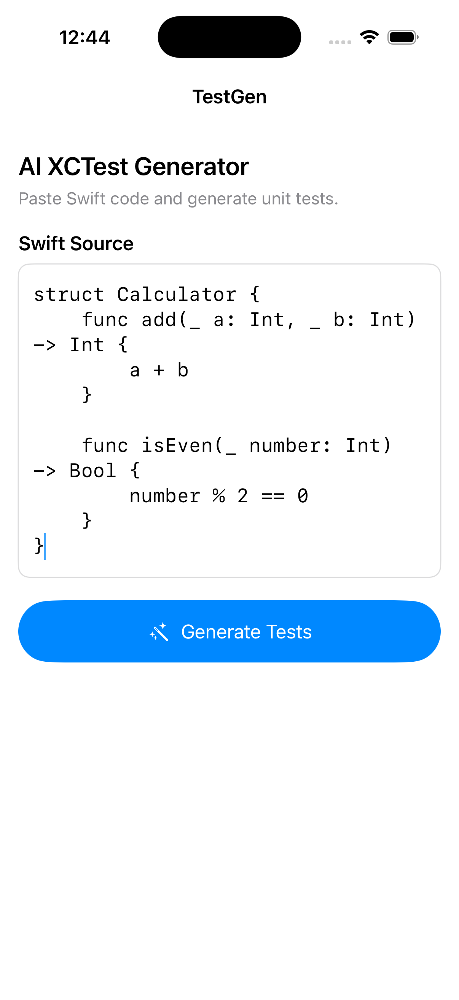
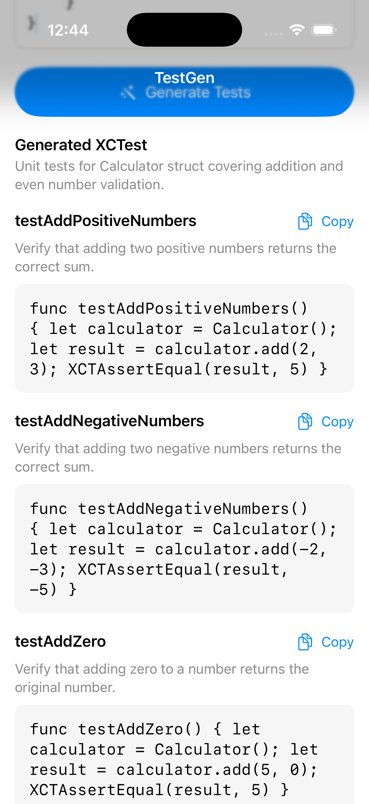

# TestGen

TestGen is an AI-powered iOS application that generates XCTest unit tests from Swift source code.

Paste Swift code into the app, generate tests using Google's Gemini API, and copy the generated XCTest methods directly into your project.
## Demo

<p align="center">
  
  
</p>
## Features

- Generate XCTest unit tests from Swift source code
- AI-powered generation using Gemini
- Structured JSON responses mapped to Swift models
- Generates multiple test cases, including relevant edge cases
- Async network requests using Swift Concurrency
- Loading and error states
- Scrollable generated test results
- Copy individual test methods to the clipboard
- Visual "Copied" confirmation
- Dependency injection through an `AIProvider` protocol
- Mock AI provider for development and SwiftUI previews
- API configuration excluded from Git

## Architecture

TestGen separates the UI, application state, and AI service layer.

```text
SwiftUI View
    │
    ▼
TestGenerationViewModel
    │
    ▼
AIProvider
    │
    ├── GeminiAIProvider
    │
    └── MockAIProvider
    │
    ▼
GeneratedTestSuite
```

### AIProvider

The app depends on an abstraction rather than directly depending on Gemini:

```swift
protocol AIProvider {
    func generateTests(
        for sourceCode: String
    ) async throws -> GeneratedTestSuite
}
```

This allows different AI implementations to be injected without changing the ViewModel.

For example:

- `GeminiAIProvider` handles real AI generation.
- `MockAIProvider` provides deterministic local data for development and previews.

## Tech Stack

- Swift
- SwiftUI
- MVVM
- Swift Concurrency (`async/await`, `Task`)
- URLSession
- Codable
- XCTest
- Google Gemini API
- Dependency Injection

## Project Structure

```text
TestGen/
├── App/
│   └── TestGenApp.swift
│
├── Core/
│   └── AppConfiguration.swift
│
├── Features/
│   └── TestGeneration/
│       ├── Models/
│       │   ├── GeneratedTestSuite.swift
│       │   └── GenerationState.swift
│       │
│       ├── ViewModels/
│       │   └── TestGenerationViewModel.swift
│       │
│       └── Views/
│           └── ContentView.swift
│
└── Services/
    └── AI/
        ├── AIProvider.swift
        ├── GeminiAIProvider.swift
        └── MockAIProvider.swift
```

## How It Works

1. The user enters Swift source code.
2. `ContentView` sends the generation action to `TestGenerationViewModel`.
3. The ViewModel calls the injected `AIProvider`.
4. `GeminiAIProvider` sends the source code to the Gemini API.
5. Gemini returns a structured JSON response.
6. The response is decoded into `GeneratedTestSuite`.
7. SwiftUI renders the generated XCTest cases.
8. Individual test methods can be copied to the clipboard.

## Setup

### 1. Clone the repository

```bash
git clone https://github.com/deepthipy/TestGen-ios.git
cd TestGen-ios
```

### 2. Create a Gemini API key

Create a Gemini API key using Google AI Studio.

### 3. Create the local secrets configuration

At the root of the project, create:

```text
Secrets.xcconfig
```

Add:

```text
GEMINI_API_KEY = YOUR_API_KEY_HERE
```

`Secrets.xcconfig` is intentionally excluded from Git.

### 4. Configure Xcode

Open the project in Xcode and ensure the Debug configuration uses:

```text
Secrets.xcconfig
```

The application reads the value through:

```text
GEMINI_API_KEY
```

in the app configuration.

### 5. Run

Build and run the project using Xcode.

Paste Swift code into the editor and select **Generate Tests**.

## Example

Input:

```swift
struct Calculator {
    func add(_ a: Int, _ b: Int) -> Int {
        a + b
    }

    func isEven(_ number: Int) -> Bool {
        number % 2 == 0
    }
}
```

TestGen can generate XCTest cases covering expected behaviour and relevant edge cases.

## Security

`Secrets.xcconfig` is excluded from source control so the Gemini API key is not committed to the repository.

However, build-time configuration does **not** make an API key secret inside a distributed iOS application. A key embedded in an application bundle can potentially be extracted.

The current configuration is intended for local development and portfolio demonstration. A production implementation should route AI requests through a secure backend or another appropriate credential-management architecture.

## Roadmap

Planned improvements include:

- Automatic retry with exponential backoff for transient API failures
- AI model fallback strategy
- Improved API error handling
- Unit tests for the ViewModel and AI service
- Generated test history
- Improved code presentation
- Copy entire generated test suite
- Additional generation configuration
- CI with automated build and test validation

## Author

**Deepthi Venugopal**

iOS / macOS Engineer

GitHub: `deepthipy`
